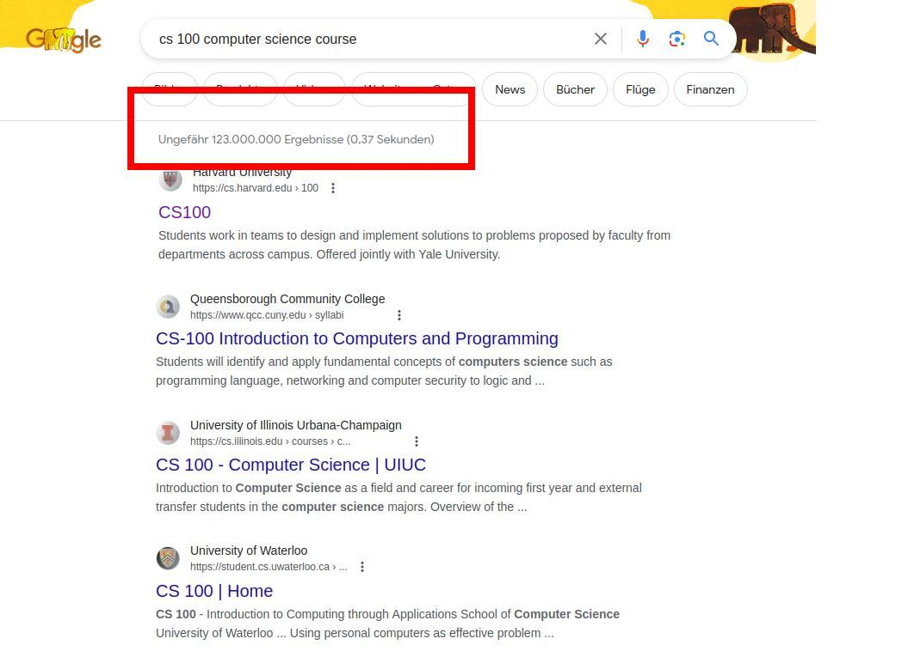

<!--
author:   Sebastian Zug

email:    Sebastian.Zug@informatik.tu-freiberg.de

version:  1.0.4

language: de

narrator: UK English Female

mode:     Presentation

comment:  This course introduces LiaScript and explains the benefits of the new,
          open-source concept.

logo:     ./images/logo.png

import: https://github.com/liascript/CodeRunner
        https://raw.githubusercontent.com/liaTemplates/processingjs/master/README.md

translation: Deutsch  translations/German.md
-->

## Motivation

{{0-2}}
> Question: Who is familiar with the ideas of [Open Educational Ressources](https://www.unesco.org/en/open-educational-resources) (OER)?

     {{1-2}}
********************************************************************************

<!--
style="width: 100%; max-width: 860px; display: block; margin-left: auto; margin-right: auto;"
-->
```ascii

Version 1.0                           Version 1.1
+---------------------------+          +---------------------------+
| Course  German Literatur  |          | Course  German Literature |
| Authors John Muster       | "Error"  | Authors John Muster       |
|                           |------->  |         Angelika Maier    |----->
|~~~~~~~~~~~~~~~~~~~~~~~~~~~|          |~~~~~~~~~~~~~~~~~~~~~~~~~~~|
| In 1756 Goethe visited    |---.      | In 1786 Goethe visited    |--.
| Italy ...                 |   |      | Italy ...                 |  |
                                |                                     |
                                |                                     |    +----------------------------+
                                |                                     |    | Course  Deutsche Literatur |
                                |                                     |    | Authors John Muster        |
                                |                                     .--> |         Angelika Maier     |
                                |                                          |         Steve Gray         |
                                |                                          |~~~~~~~~~~~~~~~~~~~~~~~~~~~~|
                                |                                          | 1786 reiste Goethe nach    |
                                |                                          | Italien ...                |
                                |       Version 1.0
                                |      +---------------------------+
                                |      | Course  Goethe & Schiller |
                                |      | Authors John Muster       |
                                .-->   |         Angelika Maier    |----->
                                       |~~~~~~~~~~~~~~~~~~~~~~~~~~~|
                                       | The correspondence during |
                                       | the Italian journey ...   |
```
*Versions of the content of a course and their reuse in other contexts*

    --{{1}}--
How should teaching materials be created that really deserve the O E R idea?
They should be freely available AND manipulable. Some protagonists of the
community emphasize the first aspect and annotate a PDF document as open. But
courses on a topic are very different, a teacher sets varying priorities or
chooses another contexts. Hence, a complete adoption is not enough. Furthermore,
it is necessary to provide materials that can be revised and newly compiled. The
Figure illustrates this. A number of authors corrected errors and developed
content that goes into different directions. This also results in completely new
course configurations or translations of content. What other platform for a
successful multi-editor knowledge collections could be used as an inspiring
example?

********************************************************************************

     {{2-3}}
********************************************************************************

__But what is the reality?__



> Question: What are similar approaches to the OER idea?

********************************************************************************

## Wikipedia as a role model?

     {{0-1}}
********************************************************************************

Wikipedia as a web-based system has brought together millions of authors and
users. Why does this project succeeds?

> Question: Who of you has already adapted a Wikipedia file?

https://en.wikipedia.org/wiki/Federal_University_of_Amazonas

********************************************************************************

     {{1-2}}
********************************************************************************

| Reasons for success                 | Comments                                                                                                                                                                                                                             |
| ----------------------------------- | ------------------------------------------------------------------------------------------------------------------------------------------------------------------------------------------------------------------------------------ |
| Versioning method                   | Wikipedia stores the entire history of a document. This makes it possible to reconstruct changes, to merge versions, and thus, to eliminate errors very easy.                                                                        |
| Simple context description language | The content in Wikipedia are edited in a simple description language [wikitext](https://de.wikipedia.org/wiki/Wikitext). Unlike Word or PDF documents, these are simple text files that can be manipulated in the browser by anyone. |
| Integrated editor                   | Users can make changes in the description language directly within the browser. No separate tool and installation is necessary.                                                                                                      |

********************************************************************************

     {{2-3}}
********************************************************************************

But of course, we cannot map the Wikipedia concept 1:1 to learning content!

Course content ...

+ ... is not only text, but also includes animations, videos, and interactive elements.
+ ... depends on specific learning goals and the didactic concept of the teacher.
+ ... has to be iterated in a learning management system mostly.

********************************************************************************

     {{4-5}}
********************************************************************************

Just as an example ...


```cpp                         Processing.js
void setup() {
  size(480, 220);
}

void draw() {
  if (mousePressed) {
    fill(0);
  } else {
    fill(255);
  }
  ellipse(mouseX, mouseY, 80, 80);
}
```
@Processing.eval

********************************************************************************

## Vision of LiaScript

This is where the concept of LiaScript comes in and integrates 

+ mechanisms for dynamic websites
+ supports different distribution strategies and thus different versions of material.
+ can be integrated into the usual LMS.

{{1-2}}
> How does it work in detail? Let's take a closer look on LiaScript in the second part of this tutorial.