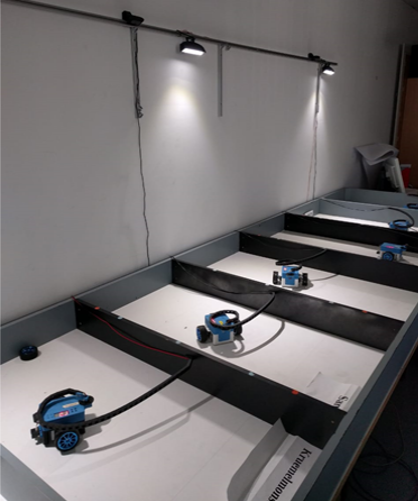
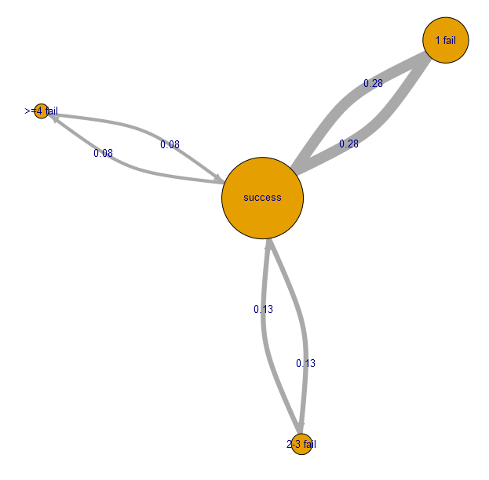

<!--
author:  André Dietrich; Sebastian Zug

mode:     Presentation

comment: Interactive LiaScript workshop at Federal University of Amazonas

-->


# Digital labs as OER 

> Let's transfer the idea of OER on Digital Laboratories too!

_Accordingly, the CrossLab project aims to define the technical, didactic and organizational solutions for open digital laboratory objects, which can be combined as required in a learning environment for student-centered teaching._

<div style="width: 34%; float: left">

| Partner                  |
|--------------------------|
| TU Bergakademie Freiberg |
| TU Ilmenau               |
| TU Dortmund              |
| Nordakademie             |

</div>

<!-- style="width: 45%; float: right" -->

<div style="width: 100%; float: left">
> ___CrossLab_ is founded by Stiftung Innovation in der Hochschullehre [Link](https://stiftung-hochschullehre.de/projekt/crosslab/).__

</div>


## Motivation

> __Definition:__
> Remote laboratories provide an access to real hardware over the internet without being near the actual equipment.


                        {{1-2}}
************************************************************

| Advantages                                                                                                                             | Disadvantages                                                                             |
| :------------------------------------------------------------------------------------------------------------------------------------- | :---------------------------------------------------------------------------------------- |
| Student centric implementation of practical education in  laboratory - permanent availability                                          |                                                                                           |
| Students work with real hardware                                                                                                       |                                                                                           |
| Development environment perfectly matching the requirements                                                                            |                                                                                           |
| The remote system allows the application of learning analytics methods for improving the online appliction and corresponding lectures. | No immediate support by supervisors comparable to traditional exercises in a a laboratory |
|                                                                                                                                        | Technical efforts for installation and maintenance                                        |

************************************************************

                        {{2-3}}
************************************************************

")
")



************************************************************

## Implementation

Edrys is an open-source app that helps you teach remotely: https://edrys.org

* Live classrooms with video chat, breakout rooms, and more.
* __Allow your students to remotely control live equipment (Remote Labs)__.
* Customize your classes by adding modules (explore Edrys Modules).


    {{1}}
<section>

## Edrys - Lite


* GitHub: https://github.com/Cross-Lab-Project/edrys-Lite
* Web: https://cross-lab-project.github.io/edrys-Lite

</section>

## Demo 

The following demo shows the OER description of an digital laboratory it contains of configuration parameters for different moduls as well as the corresponding learning content.

https://github.com/LiaPlayground/Brasil_2023/blob/main/edrys_lab/Crosslab-Manaus.yml

https://raw.githubusercontent.com/TUBAF-IfI-LiaScript/VL_EAVD/master/excercise/04_OOP_stud.md

```yml
id: Msw5YCj3DZzflNZTRLTr8PbUQO721rmpCxZlDqRN
createdBy: Mj92OSQdrbcE
dateCreated: 1689064662293
name: Demonstração de CrossLab
meta:
  logo: >-
    https://raw.githubusercontent.com/TUBAF-IfI-LiaScript/VL_EAVD/master/excercise/images/excercise_04.png
  description: >-
    Os alunos implementam uma aplicação que utiliza duas classes existentes para
    o uso de componentes periféricos - sensor ultrassônico e display LCD
    - Hum. O resultado é um aplicativo que mantém continuamente a distância
    perdeu um obstáculo. Os dados também são enviados via serial
    Saída da interface e analisada.
  selfAssign: true
members:
  teacher:
    - andredietrich@web.de
    - sebastian.zug@informatik.tu-freiberg.de
  student:
    - sebastian.ernst.zug@googlemail.com
    - passe.partout@web.de
modules:
  - url: https://edrys-org.github.io/module-liascript/
    config:
      course: >-
        https://raw.githubusercontent.com/TUBAF-IfI-LiaScript/VL_EAVD/master/excercise/04_OOP_stud.md
    showInCustom: Lobby
    width: full
    height: tall
...
```

> Let's establish our own remote-lab with Edrys-Lite and LiaScript.

https://cross-lab-project.github.io/edrys-Lite/

## Information

| Reference          | Link                                                                         |
|--------------------|------------------------------------------------------------------------------|
| Projekt Website    | [https://cross-lab.org/](https://cross-lab.org/)                             |
| Project Repository | [https://github.com/Cross-Lab-Project](https://github.com/Cross-Lab-Project) |
| Edrys Repository   | [https://edrys.org/](https://github.com/Cross-Lab-Project/edrys)             |